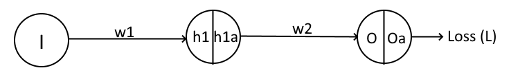

# Session 1 - Very Basics

## Assignment

Rewrite the colab file and:

1. Remove the last activation function
2. Make sure there are in total 44 parameters
3. run it for 2001 epochs

You must upload your assignment to a public GitHub Repository and share the link as the submission to this assignment 

Add a readme file to your project and describe these things:

1. What is a neural network neuron?
2. What is the use of the learning rate?
3. How are weights initialized?
4. What is "loss" in a neural network?
5. What is the "chain rule" in gradient flow?

This assignment is worth 300pts (150 for Code, and 150 for your readme file (directly proportional to your description).

## Solution

Colab file: [here](./END2_0_Session_1.ipynb) (or just scroll up, you'll find the file)

### What is a neural network neuron?

A neuron is the most basic building block of a neural network. It is modelled after a biological neuron. A biological neuron contains dendrites, body (soma), and an axon. Similar analogous components exist even in the neural network neuron.

1. **input (≈ dendrite)** receives the output from the previous neuron or the input from a source.
2. **weighted sum / activation (≈ body)** The input is transformed using the weight associated with this neuron and the previous neuron, and an activation function is applied to introduce non-linearity to the system.
3. **output (≈ axon)** The output of the transformation is passed on to the input of the next neuron in the succeeding layer.

### What is the use of learning rate?
In brief, learning rate is used to determine how much of the gradient should be used to update the weights of a network. To get an intuitive understanding of this problem, imagine this.

You are at a random point in a mountainous region, and you are blind folded. You are given the task to get to the bottom most point in the entire region and (you are sure that you won't starve to death regardless of how long it takes), so how would you do it? You would take steps in a random direction, and after each step, try to feel if you have gone downhill or uphill. repeat this process enough times and you will eventually reach the bottom most point of the region. The size of the step that was taken? That is your learning rate. Too small a learning rate and you end up taking way too long to reach the bottom most point in the region, and too large of a learning rate and you risk overshooting the bottom most point.

(The bottom most point symbolizes the smallest error possible in the model)

### How are weights initialized?
There are two common and simple ways to initialize weights, one being zero initialization and the other, random initialization.

Zero initialzation, as the name suggests, involves setting all the weights in the model to zero. This is a bad idea because, during backprop the gradient of the errors with respect to the weights will be same for all the weights, which means that all the neurons will end up learning the same features, which makes it no different from a linear model. Because of this, this method is never used.
Random initialization involves setting the weights to random values, which usually have some mean and standard deviation. This prevents all the neurons from learning the same features. One of the most common ways to set random values to the weights is to sample the values from a Gaussian distribution.

Another initialization techniques include Xavier, Kaiming, He, initializations. In pytorch, to initialize the weights of a model (say, using xavier initialization), the following can be done:

```python
def init_weights(m):
    if isinstance(m, nn.Linear):
        torch.nn.init.xavier_uniform(m.weight)
        m.bias.data.fill_(0.01)

model = nn.Sequential(nn.Linear(2, 2), nn.Linear(2, 2))
model.apply(init_weights)
```

The `model.apply` function recursively applies the given function to every submodule in `Sequential`.

### What is "loss" in a neural network?
The neural network "loss" quantifies how wrong the network is in a prediction. Quantifying this "wrongness" gives us a mathematical way to improve the network. There are different ways to calculate the loss, and each method has a different way of quantifying the "wrongness" in the prediction (with some methods having techniques to penalize incorrect predictions)

Some of the different ways of calculating the loss of a neural network are: mean squared loss, cross entropy loss, KL divergence loss, L1 loss, L2 loss, etc.

### What is the "chain rule" in gradient flow?
"Chain rule" in gradient flow is applied when calculating the amount of change to apply to a given weight. so as to improve the model. Given the following network,

<p align="center">

</p>

We have to calculate the change in the weight $w_1$ with respect to the loss $L$. As seen, loss $L$ is calulated from the output $O$, which is in turn comes from the output of the hidden layer (after activation) which in turn comes from the input node multiplied with $w_1$. Also, while calculating the gradient, the weight $w_2$ is assumed to be constant, as per partial differentiation rules. Mathematically,

$$\frac{\partial{L}}{\partial{w_1}} = \frac{\partial{L}}{\partial{O^a}} \frac{\partial{O^a}}{\partial{O}} \frac{\partial{O}}{\partial{H_1^a}} \frac{\partial{H_1^a}}{\partial{H_1}} \frac{\partial{H_1}}{\partial{w_1}}$$

There is this "chain" or "link" between $w_1$ and the final loss $L$. This chain (as shown by the equation above) is literally the chain rule in calculus, and the answer to this question.

