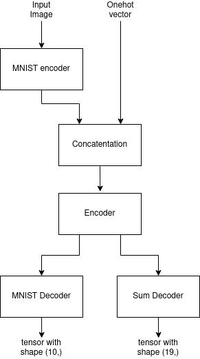
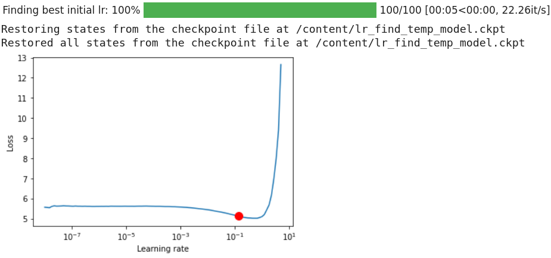
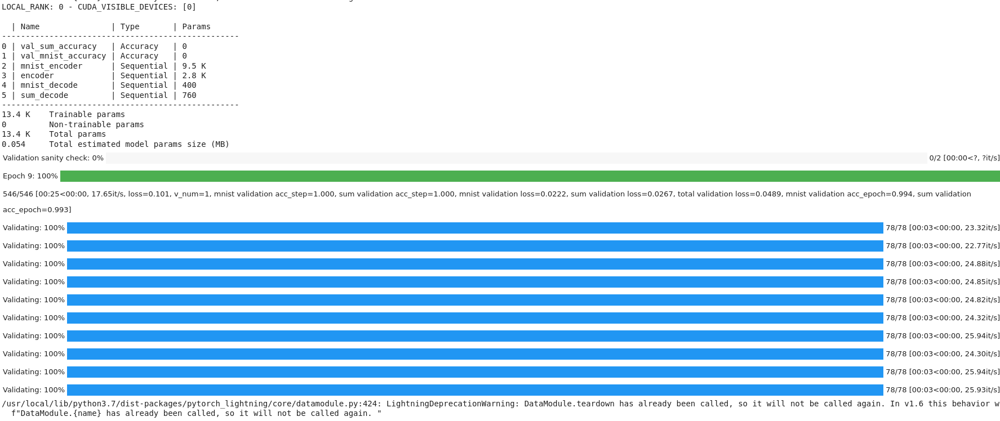
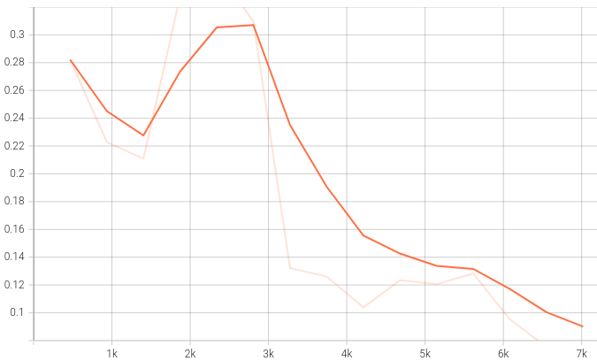
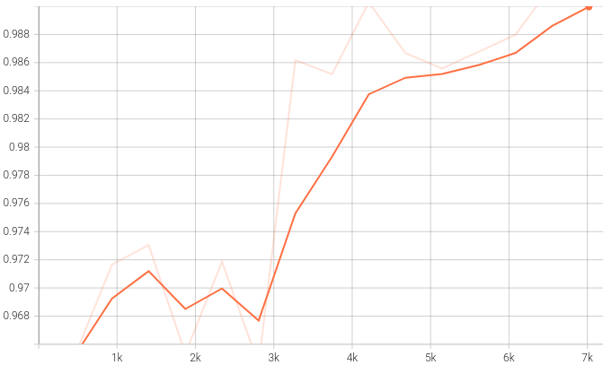
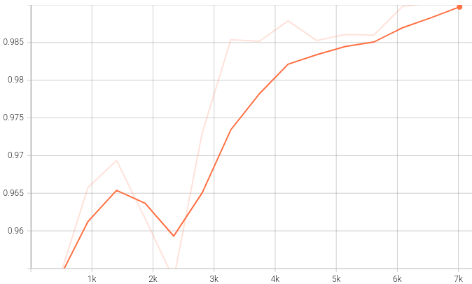
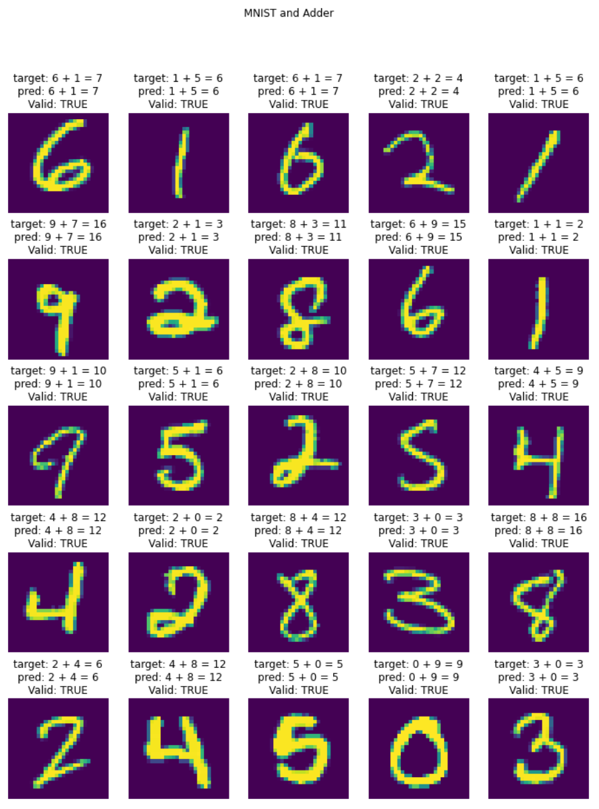

# Session 2.5 - PyTorch 101

> **This assignment was done individually**

## Assignment

Write a neural network that can:
1. take 2 inputs:
    1. an image from the MNIST dataset (say 5), and
    2. a random number between 0 and 9, (say 7)
2. and gives two outputs:
    1. the "number" that was represented by the MNIST image (predict 5), and
    2. the "sum" of this number with the random number and the input image to the network (predict 5 + 7 = 12)
3. you can mix fully connected layers and convolution layers
4. you can use one-hot encoding to represent the random number input as well as the "summed" output.
    1. Random number (7) can be represented as 0 0 0 0 0 0 0 1 0 0
    2. Sum (13) can be represented as:
        1. 0 0 0 0 0 0 0 0 0 0 0 0 0 1 0 0 0 0 0
        2. 0b1101 (remember that 4 digits in binary can at max represent 15, so we may need to go for 5 digits. i.e. 10010

Your code MUST be:
1. well documented (via readme file on github and comments in the code)
2. must mention the data representation
3. must mention your data generation strategy (basically the class/method you are using for random number generation)
4. must mention how you have combined the two inputs (basically which layer you are combining)
5. must mention how you are evaluating your results 
6. must mention "what" results you finally got and how did you evaluate your results
7. must mention what loss function you picked and why!
7. training MUST happen on the GPU
8. Accuracy is not really important for the SUM

Once done, upload the code with short training logs in the readme file from colab to GitHub, and share the GitHub link (public repository)

## Solution

### Data representation and generation strategy

To represent the number and the sum, one hot encoding is used. The dataset class generates a random number using numpy, converts the number into a one hot vector, and converts the sum of the number and the MNIST digit into a one hot vector, and returns it. A snippet of the code that does this:

```python
class MnistDataset(MNIST):
    def __init__(self, *args, **kwargs):
        super().__init__(*args, **kwargs)

    def __getitem__(self, index):
        img, label = super().__getitem__(index)

        number = np.random.randint(low=0, high=10)
        onehot_num = F.one_hot(torch.tensor(number), num_classes=10)

        # 19 classes since max sum that is possible is 18, so including 0
        # as the least possible sum, that gives us 19 numbers
        onehot_sum = F.one_hot(torch.tensor(label + number), num_classes=19)

        if not isinstance(img, (torch.Tensor, np.ndarray)):
            img = np.array(img)

        return (img, onehot_num), (label, onehot_sum)
```

The size of the onehot vector for the input number is `(10,)` whereas the size of the onehot vector for the sum is `(19,)`, since the max sum that can occur given two single digit numbers is 18, and including 0, that is 19 numbers.

### Model architecture

<p align="center">

</p>

The input image is fed into the "MNIST encoder" block that converts the image into a feature vector of size `(15,)`. This is then concatenated with the onehot vector that represents the number, which results in a final vector of size `(25,)`. This vector is fed into an "Encoder" block, which consists of two linear layers and outputs a tensor of shape `(40,)`, containing the representation of both the MNIST digit and the sum. The output of this block is then fed into two more blocks, one which takes the representation and finds the digit the image represented (output shape: `(10,)`), and the other takes the representation and finds the sum of the digit and the number which was given as input (output shape: `(19,)`).

### Training

The training was done on GPU (as mentioned in the assignment question) and pytorch lightning was used to avoid some boilerplate code. The model was trained for 10 epochs.

forward pass:

```python
def forward(self, img, number):
    x = self.mnist_encoder(img)
    x = torch.cat([x, number], -1)
    x = self.encoder(x)

    mnist_out = self.mnist_decode(x)
    sum_out = self.sum_decode(x)

    return mnist_out, sum_out
```


### Loss functions

The loss function used for both the outputs was cross entropy loss, which was a good fit given the model should output the onehot representation of the sum of the MNIST digit and the number. And for MNIST classification, cross entropy loss is a good one to use. The total loss was just the sum of the two individual losses. Weighted loss can also be used, but it seemed like overkill.

```python
def training_step(self, batch, batch_idx):
    (img, num), (label, sum_label) = batch
    mnist_pred, sum_pred = self(img, num)

    mnist_loss = F.cross_entropy(mnist_pred, label)
    sum_loss = F.cross_entropy(sum_pred, torch.argmax(sum_label, dim=1))
    loss = mnist_loss + sum_loss
    ...
    return loss
```

### Evaulation

The outputs of the last two blocks ("MNIST Decoder" and "Sum Decoder") are fed into softmax, and the argmax of the result is used to calculate classification accuracy. the torchmetrics package is used to calculate the classification accuracy, since it has nice interoperatibility with pytorch lightning. 

```python
class MnistAndAdd(pl.LightningModule):
    def __init__(self, lr=0.1, dropout_val=0.1, epochs=10):
        ...
        self.val_sum_accuracy = torchmetrics.Accuracy()
        self.val_mnist_accuracy = torchmetrics.Accuracy()
        ...
    ...

    def validation_step(self, batch, batch_idx):
        (img, num), (label, sum_label) = batch
        mnist_pred, sum_pred = self(img, num)

        mnist_loss = F.cross_entropy(mnist_pred, label)
        sum_loss = F.cross_entropy(sum_pred, torch.argmax(sum_label, dim=1))
        loss = mnist_loss + sum_loss

        mnist_pred = torch.argmax(F.log_softmax(mnist_pred, dim=1), dim=1)
        sum_pred = torch.argmax(F.log_softmax(sum_pred, dim=1), dim=1)

        self.val_mnist_accuracy(mnist_pred, label)
        self.val_sum_accuracy(sum_pred, torch.argmax(sum_label, dim=1))
        ...
```

The accuracy metric from torchmetrics, according to the [code](https://github.com/PyTorchLightning/metrics/blob/master/torchmetrics/classification/accuracy.py), does this:

<p align="center">

</p>

### Results

**LR finder results**

<p align="center">

</p>

**Training Logs**

<p align="center">

</p>

<table>
    <tr>
        <td><b>Validation loss</b></td>
    </tr>
    <tr>
        <td></td>
    </tr>
</table>

| Validation accuracy: MNIST|Validation accuracy: Sum|
| ----------- | ----------- |
| ||

**Results**

<p align="center">

</p>

> Quick Note: The training logs in the notebook look weird / incomplete, because of how tqdm and pytorch lightning prints logs. Also, most of the code is written in a self documenting manner.
