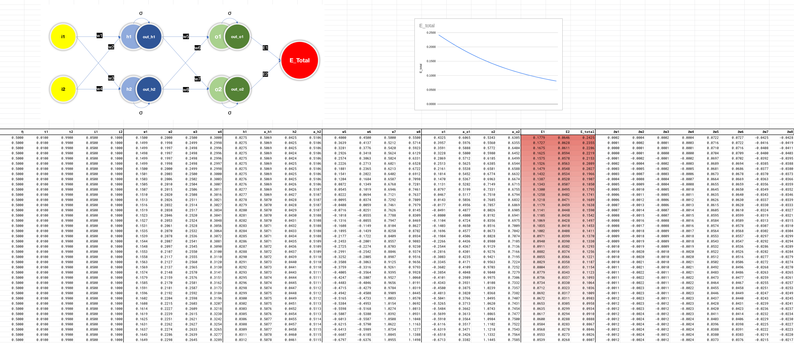
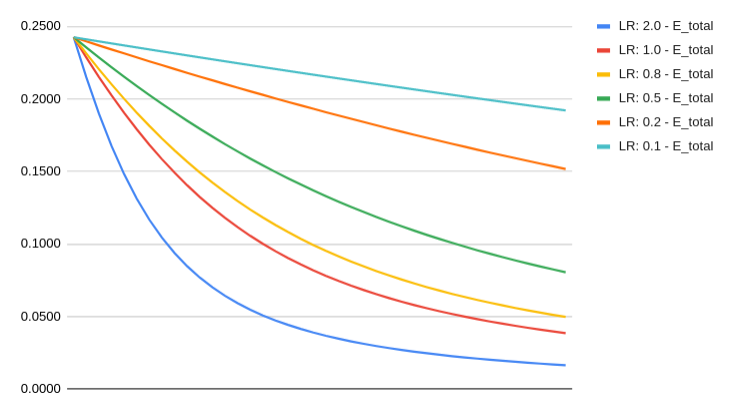

# Session 2 - Backprop, embeddings and language models

> **This assignment was done individually.**

## Assignment

1. Rewrite the whole excel sheet showing backpropgation. Explain each major step, and write it on Github.
    1. Use exactly the same values for all variables as used in the class
    2. Take a screenshot, and show that screenshot in the readme file
    3. Excel file must be there for us to cross-check the image shown on readme (no image = no score)
    4. Explain each major step
    5. Show what happens to the error graph when you change the learning rate from [0.1, 0.2, 0.5, 0.8, 1.0, 2.0] 
2. Submit the GitHub link. Github link must be public (check the link without logging in, if it opens, then only share the link as an assignment).

## Solution

### The screenshot

### Change in error graph when learning rate changes

> Link to the excel sheet: [this](https://docs.google.com/spreadsheets/d/1zqqTc2r3kWBV5GbFiD7YKWVv1ML3lLN961KAfp9Mjvg/edit?usp=sharing)

### Major steps

First thing to do is to forward prop the data. That is easy enough, since its just weighted sum and then activation function. Once you get to the last layer, the total error can be calculated using an appropriate loss function. 

For backprop, the gist of it is this: find the "path" to get to the value, and translate that path to chain rule. 

To understand this better, consider this: calculating gradient of *w5* w.r.t *E_total*. To get to *E_total* from *w5*, there is only one "path", which is from *w5* to *o1*, from *o1* to *out_o1* and from *out_o1* to *E_total*. Writing this same exact thing in terms of chain rule,

taking it a step further, to calculate the gradient of *w1* w.r.t *E_total*, there are two paths, which is from *w1* to *h1*, *h1* to *out_h1*, *out_h1* to *o1*, from *o1* to *out_o1* and from *out_o1* to *E_total*, and *w1* to *h1*, *h1* to *out_h1*, *out_h1* to *o2*, from *o2* to *out_o2* and from *out_o2* to *E_total*. Translating this mess into chain rule,

For the most part, the values of the partial derivatives can be obtained by simply differentiating the forward prop equations, which will directly yield a result. Keep in mind that while performing partial differentiation w.r.t a weight, the other weights are kept constant.

