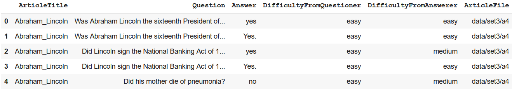
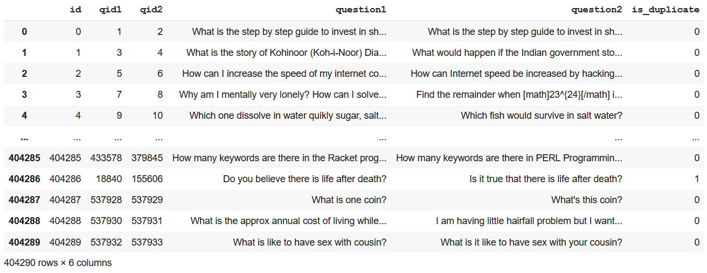

# RNN/LSTM With Attention Mechanism

## Assignment

1. Train model we wrote in the class on the following two datasets taken from this link (Links to an external site.): 
    1. http://www.cs.cmu.edu/~ark/QA-data/ (Links to an external site.)
    2. https://quoradata.quora.com/First-Quora-Dataset-Release-Question-Pairs (Links to an external site.)
2. Once done, please upload the file to GitHub and proceed to share the things asked below:
    1. Share the link to your GitHub repo (100 pts for code quality/file structure/model accuracy) (100 pts)
    2. Share the link to your readme file (100 points for proper readme file)
    3. Copy-paste the code related to your dataset preparation for both datasets.  (100 pts)
    4. If your model trains and gets to respectable accuracy (200 pts). 

Please remember that the objective of this assignment is to learn how to write code step by steps, so I should be seeing your exploration steps. 

## Solution

|         | Notebook           | Logs  |
| ------------- |:-------------:|:-----:|
| WikiQA Dataset      | [here](./end3-session-6-wiki-QA.ipynb) | - |
| WikiQA Model      | [here](./end3-session-6-wikiQA-model.ipynb)      |  [here](https://tensorboard.dev/experiment/jeqXwl10Q5WF40ugltAnMA/#) |
| Quora Duplicate Questions Dataset | [here](./end3-session-6-quora-QA.ipynb)      |    - |
| Quora Duplicate Questions Model | [here](./end3-session-6-quora-QA-model.ipynb)      |    [here](https://tensorboard.dev/experiment/jyHWDWl8RWe0eVTYnQfyWg/#) |

### WikiQA

#### Dataset
The dataset consists of three files (which we need as of now). All the files have the same format, they just were collected at different times (according to the dataset readme). Since its a tab separated file, we can load it using pandas.

```python
df = pd.read_csv("data/Question_Answer_Dataset_v1.2/S08/question_answer_pairs.txt", sep="\t", encoding="iso-8859-1")
df.head()
```

<p align="center">

</p>

There were a few NA/NAN values in the dataset, and the rows containing those values were just dropped. Also, we are just interested in the `Question` and `Answer` columns. The complete dataset class is:

```python
class WikiQA(Dataset):
    url = "http://www.cs.cmu.edu/~ark/QA-data/data/Question_Answer_Dataset_v1.2.tar.gz"
    tar = "Question_Answer_Dataset_v1.2.tar.gz"
    _mask = None

    def __init__(self, root: Union[str, Path], download=False, train=True, max_length=None):
        super().__init__()
        self.root = Path(root) if isinstance(root, str) else root
        self.train = train
        self.max_length = max_length

        # downloading dataset
        if download:
            WikiQA.download(self.root)

        # creating tokenizer
        self.tokenizer = get_tokenizer("basic_english")

        # reading the three files in the S08, S09 and S10 folders
        frames = []
        for s in ["S08", "S09", "S10"]:
            df = pd.read_csv(self.root/"Question_Answer_Dataset_v1.2"/s/"question_answer_pairs.txt", sep="\t", encoding="iso-8859-1")
            df = df[["Question", "Answer"]]
            df.dropna(inplace=True)
            frames.append(df)
        self.df = pd.concat(frames)
        if max_length:
            self.df = self.df[self.df.apply(
                # subtracting 2 from max length cuz of sos and eos tokens
                lambda row: len(self.tokenizer(row.Question)) <= max_length - 2 and len(self.tokenizer(row.Answer)) <= max_length - 2, 
                axis=1
            )]
        self.df.reset_index(inplace=True, drop=True)

        # using random splitting for now
        # setting the train-test split mask if its not set
        if WikiQA._mask is None:
            WikiQA._mask = np.random.rand(len(self.df)) < 0.8
        # splitting into train or test dataset
        if train:
            self.df = self.df[WikiQA._mask]
        else:
            self.df = self.df[~WikiQA._mask]

        # generating vocab
        def yield_tokens(dataframe: pd.DataFrame):
            for row in dataframe.itertuples():
                yield self.tokenizer(row.Question) + self.tokenizer(row.Answer)
        
        self.vocab = build_vocab_from_iterator(yield_tokens(self.df), specials=["<unk>", "<sos>", "<eos>", "<pad>"])
        self.unk_idx = self.vocab["<unk>"]
        self.eos_idx = self.vocab["<eos>"]
        self.sos_idx = self.vocab["<sos>"]
        self.pad_idx = self.vocab["<pad>"]
        self.vocab.set_default_index(self.unk_idx)

        # defining pipelines
        self.text_pipeline = lambda x: self.vocab(self.tokenizer(x))
        self.label_pipeline = lambda x: self.vocab(self.tokenizer(x))
    
    def __getitem__(self, index):
        row = self.df.iloc[index]
        return self.text_pipeline(row["Question"]), self.label_pipeline(row["Answer"])

    def __len__(self):
        return len(self.df)

    def collate_fn(self):
        def wrapper(batch):
            texts, labels = zip(*batch)
            lengths = torch.LongTensor([len(s) for s in texts])

            # adding the SOS and EOS tokens
            texts = [
                torch.cat([
                    torch.tensor([self.sos_idx]), 
                    torch.tensor(s), 
                    torch.tensor([self.eos_idx])
                ]) for s in texts
            ]
            labels = [
                torch.cat([
                    torch.tensor([self.sos_idx]), 
                    torch.tensor(l), 
                    torch.tensor([self.eos_idx])
                ]) for l in labels
            ]

            texts = torch.nn.utils.rnn.pad_sequence(texts, padding_value=self.pad_idx, batch_first=False)
            labels = torch.nn.utils.rnn.pad_sequence(labels, padding_value=self.pad_idx, batch_first=False)

            if self.max_length:
                # if max_length was set and the number of tokens in this batch is less
                # than max_length, pad the remaining space (this can happen if by chance
                # every sample in the batch has the number of tokens < max_length)
                if texts.size(0) < self.max_length:
                    texts = F.pad(texts, (0, 0, 0, self.max_length - texts.size(0)), value=self.pad_idx)
                if labels.size(0) < self.max_length:
                    labels = F.pad(labels, (0, 0, 0, self.max_length - labels.size(0)), value=self.pad_idx)

            return texts, labels, lengths

        return wrapper

    @staticmethod
    def download(root: Union[str, Path]):
        root = Path(root) if isinstance(root, str) else root
        if root.exists():
            return

        root.mkdir(parents=True)

        # downloading dataset
        res = requests.get(WikiQA.url, stream=True)
        if res.status_code != 200:
            raise Exception("Download failed.")
        with open(str(root/WikiQA.tar), "wb") as f:
            f.write(res.raw.read())

        # extracting dataset
        with tarfile.open(str(root/WikiQA.tar)) as f:
            f.extractall(str(root))
```

#### Training logs

The training logs can be viewed on tensorboard, the links are given above. As for the stdout logs, pytorch lightning doesnt have a nice way of showing logs, but the logs can be seen in the notebook (again, link's at the top).

### Quora Similar Questions

#### Dataset

This dataset is also a tab separated file, so pandas it is.

```python
df = pd.read_csv("quora_duplicate_questions.tsv", sep="\t")
df
```

<p align="center">

</p>

This dataset is considerably bigger than the WikiQA dataset. Also, here we just need the rows were the questions are same, and the `question1` and `question2` column. Just like before, the rows containing NA/NAN values were dropped (there were just 2 or 3 rows with such values in this dataset). The dataset class is:

```python
class QuoraDuplicateQuestions(Dataset):
    url = "http://qim.fs.quoracdn.net/quora_duplicate_questions.tsv"
    file_name = "quora_duplicate_questions.tsv"
    _mask = None

    def __init__(self, root: Union[str, Path], download=False, train=True, max_length=None):
        super().__init__()
        self.root = Path(root) if isinstance(root, str) else root
        self.train = train
        self.max_length = max_length

        # downloading dataset
        if download:
            QuoraDuplicateQuestions.download(self.root)

        # creating tokenizer
        self.tokenizer = get_tokenizer("basic_english")

        # reading the file
        df_ = pd.read_csv(self.root/QuoraDuplicateQuestions.file_name, sep="\t")
        self.df = df_[df_["is_duplicate"] == 1]
        if max_length:
            self.df = self.df[self.df.apply(
                # subtracting 2 from max length cuz of sos and eos tokens
                lambda row: len(self.tokenizer(row.question1)) <= max_length - 2 and len(self.tokenizer(row.question2)) <= max_length - 2, 
                axis=1
            )]
            self.df.reset_index(inplace=True, drop=True)

        # using random splitting for now
        # setting the train-test split mask if its not set
        if QuoraDuplicateQuestions._mask is None:
            QuoraDuplicateQuestions._mask = np.random.rand(len(self.df)) < 0.8
        # splitting into train or test dataset
        if train:
            self.df = self.df[QuoraDuplicateQuestions._mask]
        else:
            self.df = self.df[~QuoraDuplicateQuestions._mask]

        # generating vocab
        def yield_tokens(dataframe: pd.DataFrame):
            for row in dataframe.itertuples():
                yield self.tokenizer(row.question1) + self.tokenizer(row.question2)
        
        self.vocab = build_vocab_from_iterator(yield_tokens(self.df), specials=["<unk>", "<sos>", "<eos>", "<pad>"])
        self.unk_idx = self.vocab["<unk>"]
        self.eos_idx = self.vocab["<eos>"]
        self.sos_idx = self.vocab["<sos>"]
        self.pad_idx = self.vocab["<pad>"]
        self.vocab.set_default_index(self.unk_idx)

        # defining pipelines
        self.text_pipeline = lambda x: self.vocab(self.tokenizer(x))
        self.label_pipeline = lambda x: self.vocab(self.tokenizer(x))
    
    def __getitem__(self, index):
        row = self.df.iloc[index]
        return self.text_pipeline(row.question1), self.label_pipeline(row.question2)

    def __len__(self):
        return len(self.df)

    def collate_fn(self):
        def wrapper(batch):
            texts, labels = zip(*batch)
            lengths = torch.LongTensor([len(s) for s in texts])

            # adding the SOS and EOS tokens
            texts = [
                torch.cat([
                    torch.tensor([self.sos_idx]), 
                    torch.tensor(s), 
                    torch.tensor([self.eos_idx])
                ]) for s in texts
            ]
            labels = [
                torch.cat([
                    torch.tensor([self.sos_idx]), 
                    torch.tensor(l), 
                    torch.tensor([self.eos_idx])
                ]) for l in labels
            ]

            texts = torch.nn.utils.rnn.pad_sequence(texts, padding_value=self.pad_idx, batch_first=False)
            labels = torch.nn.utils.rnn.pad_sequence(labels, padding_value=self.pad_idx, batch_first=False)

            if self.max_length:
                # if max_length was set and the number of tokens in this batch is less
                # than max_length, pad the remaining space (this can happen if by chance
                # every sample in the batch has the number of tokens < max_length)
                if texts.size(0) < self.max_length:
                    texts = F.pad(texts, (0, 0, 0, self.max_length - texts.size(0)), value=self.pad_idx)
                if labels.size(0) < self.max_length:
                    labels = F.pad(labels, (0, 0, 0, self.max_length - labels.size(0)), value=self.pad_idx)

            return texts, labels, lengths

        return wrapper

    @staticmethod
    def download(root: Union[str, Path]):
        root = Path(root) if isinstance(root, str) else root
        if root.exists():
            return

        root.mkdir(parents=True)

        # downloading dataset
        res = requests.get(QuoraDuplicateQuestions.url, stream=True)
        if res.status_code != 200:
            raise Exception("Download failed.")
        with open(str(root/QuoraDuplicateQuestions.file_name), "wb") as f:
            f.write(res.raw.read())
```

#### Training logs

The training logs can be viewed on tensorboard, the links are given above. As for the stdout logs, pytorch lightning doesnt have a nice way of showing logs, but the logs can be seen in the notebook (again, link's at the top).

### Notes

1. Tried using `BucketIterator` with the new API, didn't work.
2. Both encoder and decoder uses the same optimizer, for some reason couldnt get two optimizers working with pytorch lightning.
3. Changing the structure of the encoder (adding more GRU layers, etc) affects the decoder big time (with regards to implemetation). Not sure if that is expected or not.
4. Not having the batch dimension as the fist dimension is weird, but useful while writing `forward` methods.
